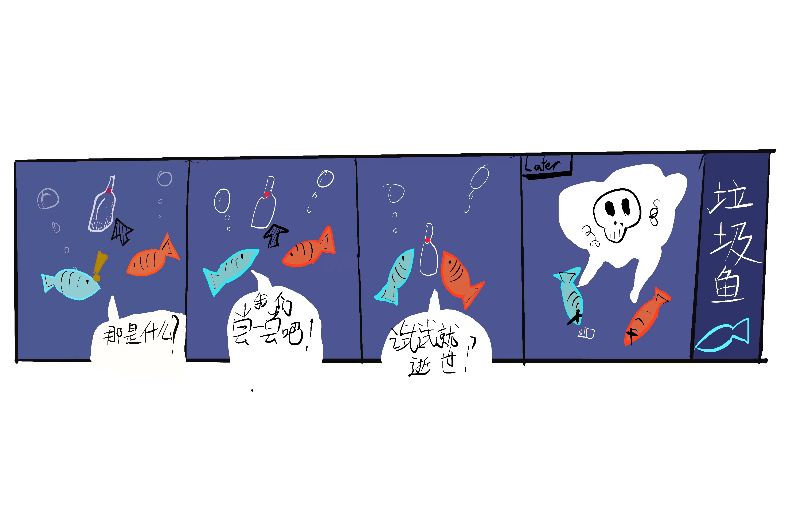

### 企鹅小天菜
#### 我是一只叫天菜的南极企鹅，我住在南极的垃圾岛。唉，现在我们企鹅家族只能住在恶心的垃圾山上。以前我们都能住在舒服的冰上呢！还有，现在每天都有很多的游客在我们旁边拍照，一点都不为企鹅家族着想。而且食物也非常匮乏，海里面的大部分鱼都因为食用垃圾而去世了，我们经常饥肠辘辘。每天都会有垃圾漂到我们的陆地上，连人类科学家都说照这样发展，到3500年的时候垃圾的数量就会超过鱼的数量了。所以请人类朋友们不要总是乱扔垃圾，让我们共同的家——地球，保持“绿色”。

